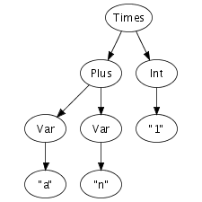

# Individual Exercises
1. Familiarize yourself with Java e.g. by following the links above.

    I will try to use haskell for this course.
2. Write a Java program that implements a data structure for the following tree



    ```
    module TopicZero where

    class Node a where
        children :: a -> [a]

    data Expr = Lit Int
              | Var String
              | Times Expr Expr
              | Plus Expr Expr
              deriving (Eq)

    instance Node Expr where
        children (Times t1 t2) = [t1, t2]
        children (Plus t1 t2) = [t1, t2]
        children _ = []

    ```

3. Extend your Java program to traverse the tree depth-first and print out information in nodes and leaves as it goes along. (Possible solutions to exercise 2 and 3 can be found on [link](http://people.cs.aau.dk/~boegholm/spo/spo_01/ ))

    ```
    instance Show Expr where
        show (Lit n) = show n
        show (Var str) = str
        show (Times t1 t2) = "(" ++ show t1 ++ " * " ++ show t2 ++ ")"
        show (Plus t1 t2) = "(" ++ show t1 ++ " + " ++ show t2 ++ ")"
    ```

4. Write a Java program that can read the string "a + n * 1" and produce a collection of objects containing the individual symbols when blank spaces are ignored (or used as separator).

    ```
    readExprIO :: IO Expr
    readExprIO = do
        expr <- getLine
        let ts = words expr
        return $ parseStrs ts

    readExpr :: String -> Expr
    readExpr = parseStrs . words

    -- | Does not actually take into account into account the order of operations
    -- | Just parses from left to right
    parseStrs :: [String] -> Expr
    parseStrs [x] = case safeRead x of
                    Just n -> Lit n
                    Nothing -> Var x
    parseStrs (x:"+":xs) = Plus (parseStrs [x]) (parseStrs xs)
    parseStrs (x:"*":xs) = Times (parseStrs [x]) (parseStrs xs)
    parseStrs _ = undefined

    -- | from hoogle
    safeRead :: Read a => String -> Maybe a
    safeRead s
      | [(x, "")] <- reads s = Just x
      | otherwise = Nothing
    ```

5. Make a list of all the computer languages you know. (Remember to include command, scripting and text processing languages)
    - Haskell
    - C#
    - Markdown
    - JavaScript
    - LaTeX
    - C
    - Python
    - html
    - CSS
    - Java
    - Visual Basic
    - Erlang
6. How well do you know the above languages?

    They are listed in from most known to least.

7. Categorize them according to the following:
    - Daily use: Haskell, LaTeX
    - Often: C#, JavaScript
    - Written a few programs: C, Python, Java, Visual Basic
    - Looked at it once or twice: Erlang

8. Which language was your first programming language?

    JavaScript

9. Use the statements associated with the Hammer Principle to evaluate each of the programming languages on your list [link](https://web.archive.org/web/20170709000745/http://www.hammerprinciple.com:80/therighttool)

    Nope too many statements

10. Compare some language features from different programming languages like for-loop in C, Java and C#. How do they differ?

11. Compare foreach loops in Java, C# and Python (you don't need to know Python to look at the loop)

    ```
    // Java
    for (type var : array)
    {
        // statements using var;
    }

    // C#
    foreach (Data_Type variable_name in Collection_or_array_Object_name)
    {
       //body of foreach loop
    }

    # Python
    for i in list:
        print(i)
    ```

    Java and C# are very similar, Python has some different syntax, but the concept is the same.

### Group Exercises

The following exercises are best done as group discussions:

1. Compare your individual programs from exercise 2, 3 and 4.
2. Make a drawing or description of the phases (internals) of a compiler (without reading the books or searching the Internet) – save this for comparison with your knowledge after the course.
3. Compare your individual list of programming languages and make a list of all the computer languages that group members know.
4. Create a list of language features group members would like in a new language. Are any of these features in conflict with each other? How would you prioritize the features?
5. Discuss what is needed to define a new programming language. Write down your conclusions for comparison with your knowledge after the course.
