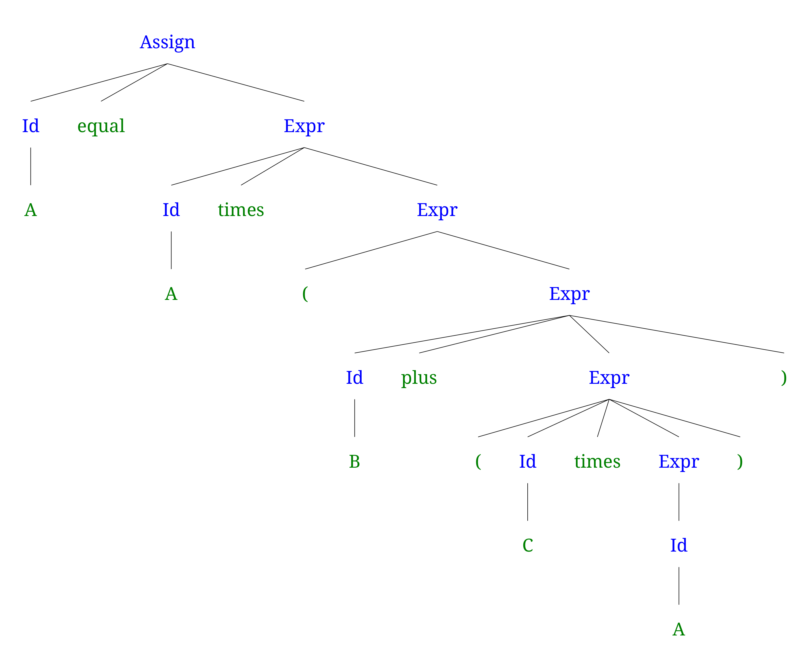
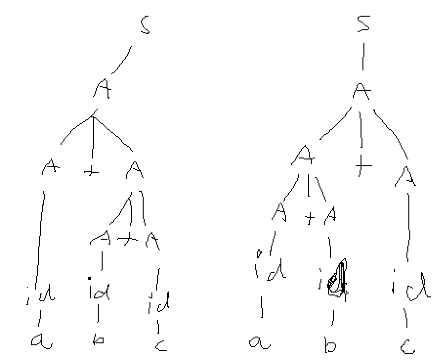

# Exercise Session 4
## Problem Set 2a and 2b on page 181
```
HeaderStatement -> AccessModifer (abstract | static | epsilon) NameToken Extends Implements

AccessModifer -> private
               | public
               | epsilon

Extends -> extends ClassToken
         | epsilon

Implements -> implements InterfaceToken ({ , InterfaceToken })*
            | epsilon

MethodStatement -> ObjectReference({.MethodStatement(Args)})+
                 | epsilon

Args -> Arg ({, Arg})*
      | epsilon

```

## Problem 4
```
<assign> -> <id> = <expr>

<id> -> A | B | C

<expr> -> <expr> + <term>
        | <term>

<term> -> <term> * <factor>
        | <factor>

<factor> -> ( <expr>)
          | <id>++
          | <id>--
          | ++<id>
          | --<id>
          | <id>
```

## Problem 3
```
<assign> -> <id> = <expr>

<id> -> A | B | C

<expr> -> <expr> * <term>
        | <term>

<term> -> <factor> + <term>
        | <factor>

<factor> -> ( <expr>)
          | <id>

```

## Problem 6a


## Problem 8
```
<S> -> <A>

<A> -> <A> + <A>
     | <id>

<id> -> a
      | b
      | c
```


